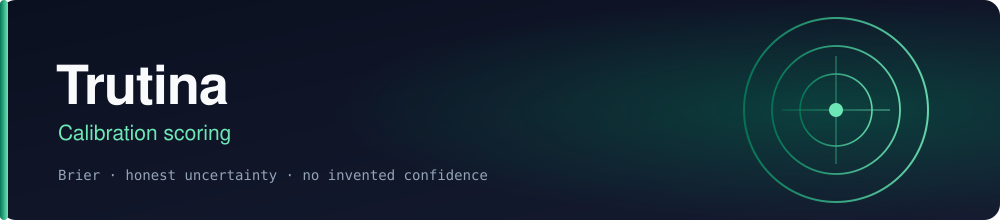

<p align="center"></p>

<p align="center">
  
  
  
</p>

# Trutina

SHADOW calibration specialist for the Abraxas stack. Assay, not minds.

Specialist id on Spec 009 is `abx.brier`. Display name is Trutina. Function slice is `trutina.score`. Packet is `brier.score.v0`. Home is `yggdrasil.replay`.

One formula: `BRIER_BINARY_V1` = (p − y)². Unsettled `forecast_request` stays R004 `NOT_COMPUTABLE`. Settled pairs take R004B.

Does not train. Does not Hub. Does not replace `outcome_brier`.

## Specs

- [constitution.md](constitution.md)
- [specs/000-trutina-spine](specs/000-trutina-spine)
- [specs/001-score](specs/001-score)
- [specs/000-brier-spine](specs/000-brier-spine) — derivative precursor

## Install

```bash
pip install -e ".[dev]"
pytest -q
```

## Shared research program (candidate)

[Trutina participation in persistent-agent research](specs/PERSISTENT-AGENT-PROGRAM.md) maps this component into ABX-NOEMA-REP-001. Advisory specification only; existing contracts and gates remain authoritative.

## Project status

- [ROADMAP.md](ROADMAP.md) — what is shipped, what is in progress, and what is deliberately not planned, each with its reason.
- [KANBAN.md](KANBAN.md) — the board, with every blocker named and evidenced.
- [CONTRIBUTING.md](CONTRIBUTING.md) — the working rules for this repository.

## License

MIT — see [LICENSE](LICENSE).
